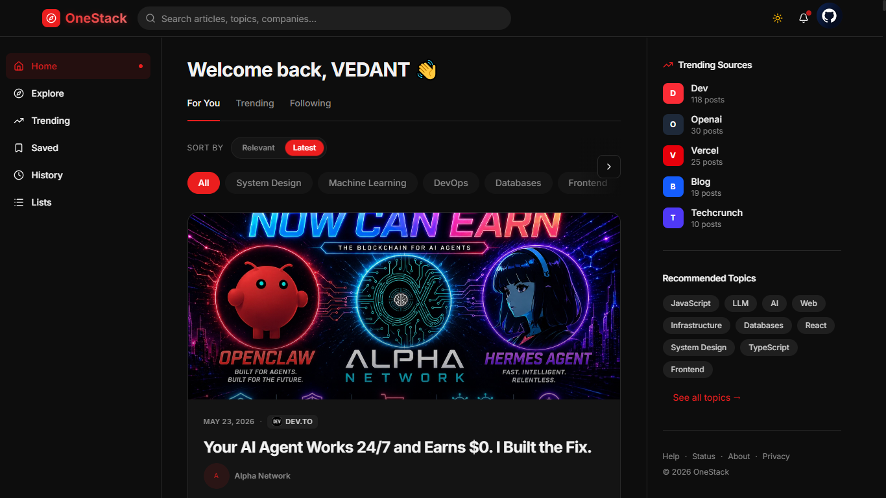
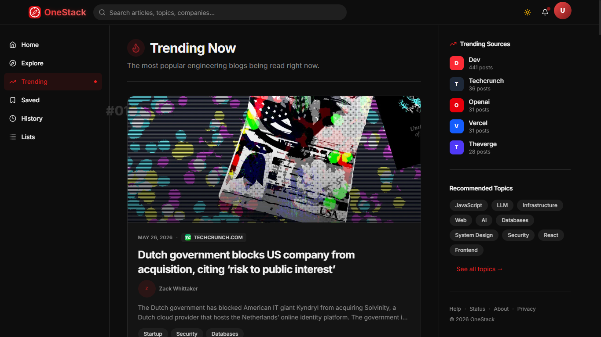
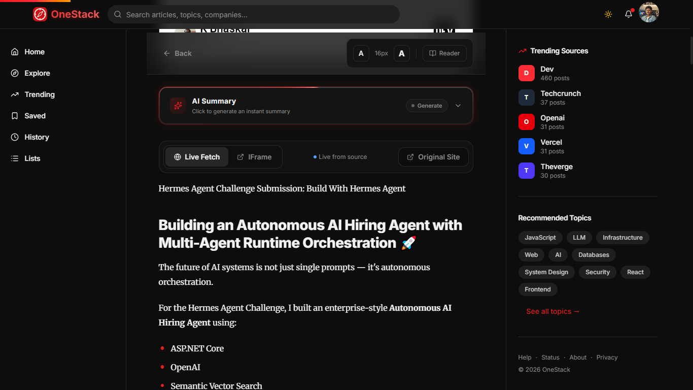
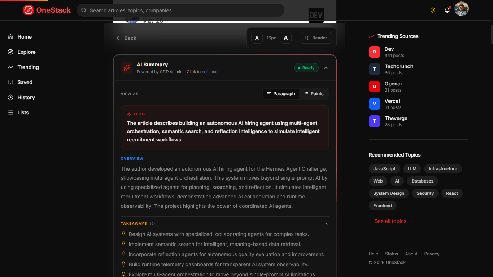
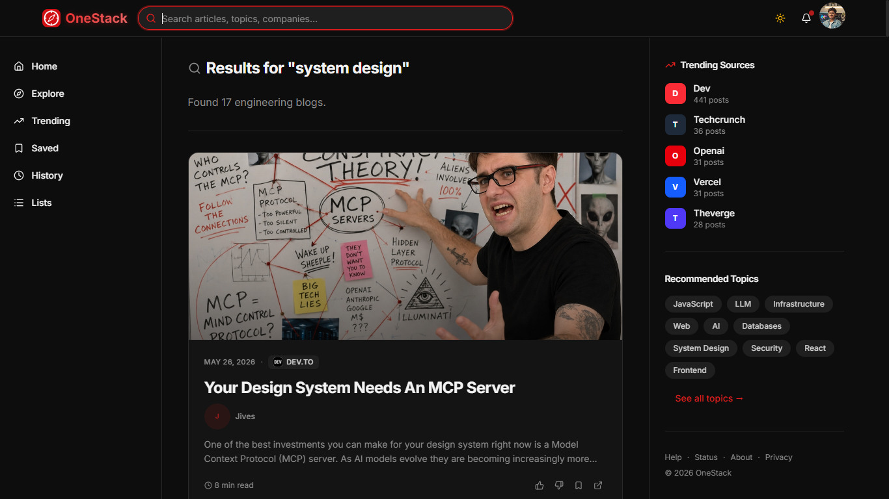
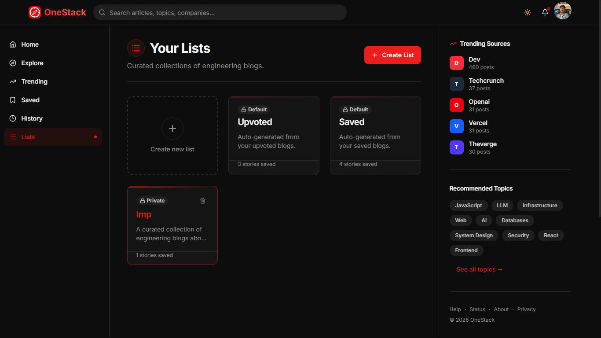
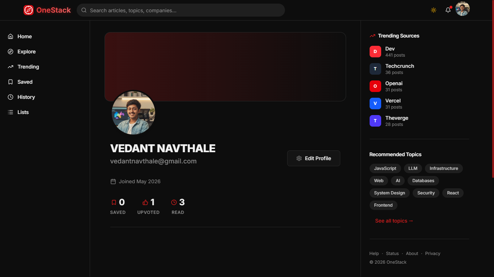
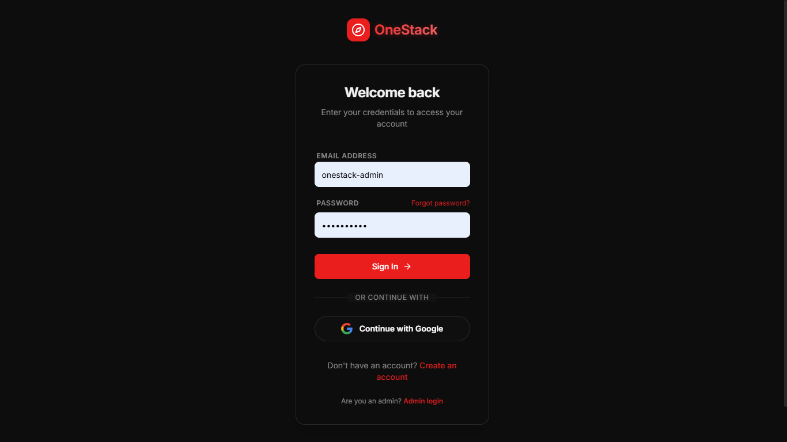
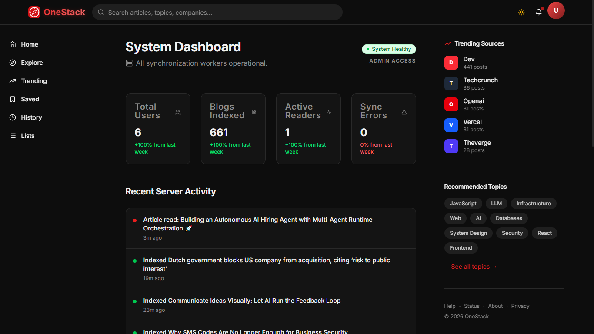

<div align="center">
  <h1> OneStack</h1>
  <h3>Engineering Blog Discovery Platform</h3>
  <p><strong>A full-stack platform that aggregates real-world engineering blogs from top tech companies, makes them searchable, and helps developers discover production-grade system design insights — all in one place.</strong></p>
</div>

<div align="center">

</div>

***

## 📖 Overview

OneStack is a **developer-first engineering content discovery platform** built to solve a simple problem: the best system design and engineering insights are scattered across company blogs, Medium posts, and personal technical write-ups.

Instead of hunting across dozens of sites for terms like **"rate limiting Uber"**, **"distributed cache Netflix"**, or **"auth system Zomato"**, OneStack brings those engineering stories into a unified experience — with search, discovery, recommendations, reading history, saves, likes, and curated lists.

The platform is designed around **real production engineering content**, not generic tutorials.

***

## 🌐 Live Demo

| Service | URL |
|---|---|
| **Frontend** | [https://onestack-web.vercel.app](https://onestack-web.vercel.app) |

***

## 🖼️ Screenshots

### 1. Home Feed


### 2. Treading Page


### 3. Blog Reading Page


### 4. AI Summarization


### 5. Search Results


### 6. Custom Reading Lists


### 7. User Profile


### 8. Login / Register


### 9. Admin Page


***

## ✨ Core Features

### 🔍 For All Users (Guest)
- Browse a unified feed of engineering blogs from top tech companies.
- Search blogs by keyword, title, topic, and company.
- Explore topic-based pages (`/topic/system-design`, `/topic/redis`, etc.).
- View trending engineering content ranked by reads and likes.
- Open individual blog pages — embedded reader or fallback summary.

### 👤 For Signed-In Users
- **Like** blogs and track them in your Liked collection.
- **Save** blogs to your personal reading list.
- **Reading History** — every blog you open is auto-logged.
- **Custom Lists** — create named collections for interview prep, topics, or companies.
- **Profile** — view your saved, liked, and read counts at a glance.
- Personalized **For You** feed powered by your interaction history.

***

## 🏗️ Architecture

```text
Blog Sources (RSS / Sitemaps / Web)
            │
            ▼
    Ingestion Worker (Queue-based)
            │
            ▼
   Content Fetcher + Metadata Extractor
            │
            ▼
      PostgreSQL Database
            │
   ┌────────┴────────┐
   │                 │
   ▼                 ▼
Full-Text Search   Recommendation Logic
   │                 │
   └────────┬────────┘
            │
            ▼
  Node.js + Express REST API
      (JWT Auth + Middleware)
            │
            ▼
      React + Vite Frontend
   (Zustand state, React Router)
```

### Why this architecture?

- **Frontend** is thin — handles only UI, routing, and API calls.
- **Backend** owns all business logic, auth, recommendation, and ingestion.
- **PostgreSQL + Prisma** provide structured relational storage for blogs, users, tags, and interactions.
- **Redis** enables fast caching and async queue-backed ingestion jobs.
- The platform is built to scale from a simple explorer to a full content recommendation engine.

***

## 🛠️ Tech Stack

### Frontend

| Package | Purpose |
|---|---|
| React 19 | UI framework |
| Vite | Build tool and dev server |
| React Router DOM | Client-side routing |
| Tailwind CSS v4 | Utility-first styling |
| shadcn/ui | Accessible component primitives |
| Zustand | Lightweight global state |
| Lucide React | Icon library |
| Axios | HTTP client |

### Backend

| Package | Purpose |
|---|---|
| Node.js + Express 5 | HTTP server and API framework |
| Prisma | ORM and schema management |
| PostgreSQL | Primary relational database |
| Redis | Cache and queue support |
| JSON Web Tokens | Access + refresh token auth |
| Bcrypt | Password hashing |
| Axios | Content fetching from external sources |
| RSS Parser | Blog feed ingestion |
| Cheerio | HTML parsing and extraction |
| Mozilla Readability | Reader-mode content extraction |

### Delivery

| Service | Purpose |
|---|---|
| Vercel | Frontend + backend deployment |
| PostgreSQL | Persistent relational storage |
| Redis | Caching and background jobs |
| Cloudflare R2 | Store Profile picture |

***

## 📁 Project Structure

```text
OneStack/
├── backend/
│   ├── prisma/
│   │   └── schema.prisma         ← Database schema (User, Blog, Tag, List, History...)
│   ├── scripts/                  ← One-time seeder / ingestion scripts
│   ├── src/
│   │   ├── config/               ← DB + Redis connection setup
│   │   ├── controllers/
│   │   │   ├── authController.js      ← Register, login, refresh, logout
│   │   │   ├── blogController.js      ← Blog CRUD, like, save, history
│   │   │   ├── listController.js      ← List create, delete, manage
│   │   │   ├── recommendationController.js ← Feed + trending logic
│   │   │   ├── searchController.js    ← Full-text blog search
│   │   │   ├── tagController.js       ← Tag / topic endpoints
│   │   │   └── userController.js      ← Profile, history, saved
│   │   ├── jobs/                 ← Background ingestion jobs
│   │   ├── middlewares/          ← Auth middleware, error handler
│   │   ├── queues/               ← Redis-backed job queues
│   │   ├── routes/
│   │   │   ├── authRoutes.js
│   │   │   ├── blogRoutes.js
│   │   │   ├── listRoutes.js
│   │   │   ├── recommendationRoutes.js
│   │   │   ├── searchRoutes.js
│   │   │   ├── tagRoutes.js
│   │   │   └── userRoutes.js
│   │   ├── services/             ← Business logic layer (blogService, userService...)
│   │   └── utils/                ← Helpers, normalizers, token utils
│   ├── server.js                 ← Entry point
│   └── vercel.json
│
├── frontend/
│   ├── public/
│   └── src/
│       ├── components/
│       │   ├── blog/             ← BlogCard, BlogFeed, BlogMeta
│       │   ├── layout/           ← Sidebar, Header, Layout
│       │   ├── search/           ← SearchBar
│       │   └── ui/               ← Button, Card, Avatar, Tag, EmptyState...
│       ├── hooks/
│       │   ├── useBlogs.js       ← Unified blog fetching + like/save logic
│       │   └── useDocumentTitle.js
│       ├── layouts/              ← MainLayout, AuthLayout
│       ├── pages/
│       │   ├── Home.jsx          ← Feed (All / For You tabs)
│       │   ├── Explore.jsx       ← Topics + Recently Added
│       │   ├── Trending.jsx      ← Trending blogs ranked by activity
│       │   ├── BlogPage.jsx      ← Individual blog reader
│       │   ├── SearchPage.jsx    ← Search results
│       │   ├── TopicPage.jsx     ← Blogs filtered by tag/topic
│       │   ├── SavedBlogs.jsx    ← User's saved reading list
│       │   ├── LikedBlogs.jsx    ← User's liked blogs
│       │   ├── History.jsx       ← Reading history
│       │   ├── Lists.jsx         ← Custom curated lists
│       │   ├── ListDetail.jsx    ← Individual list view
│       │   ├── Profile.jsx       ← User profile
│       │   ├── Login.jsx         ← Login + Google OAuth
│       │   ├── Register.jsx      ← Registration
│       │   └── NotFound.jsx
│       ├── services/             ← API service layer (blogService, listService, searchService...)
│       ├── store/
│       │   └── authStore.js      ← Zustand auth state
│       └── utils/
│           └── constants.js      ← TOPICS, fallback data
│
├── System Architecture.md
├── TechStack.md
└── README.md
```

***

## 🚀 Getting Started

### Prerequisites

- Node.js 18+
- PostgreSQL database (local or cloud)
- Redis instance (local or Upstash)
- Git

### Clone the Repository

```bash
git clone https://github.com/vednav9/OneStack.git
cd OneStack
```

### Install Backend Dependencies

```bash
cd backend
npm install
```

### Install Frontend Dependencies

```bash
cd ../frontend
npm install
```

### Set Up the Database

```bash
cd backend
npx prisma generate
npx prisma migrate dev --name init
```

***

## ⚙️ Environment Variables

### Backend — `backend/.env`

```env
# Database
DATABASE_URL=your_postgresql_connection_string

# Redis
REDIS_URL=your_redis_connection_string

# JWT Secrets
JWT_ACCESS_SECRET=your_access_token_secret
JWT_REFRESH_SECRET=your_refresh_token_secret
JWT_ACCESS_EXPIRES_IN=15m
JWT_REFRESH_EXPIRES_IN=7d

# Server
PORT=3000
NODE_ENV=development

# CORS — comma-separated allowed origins
FRONTEND_URL=http://localhost:5173

# Optional — Gemini AI for content enrichment
GEMINI_API_KEY=your_gemini_api_key
GEMINI_MODEL=gemini-2.5-flash
```

### Frontend — `frontend/.env`

```env
VITE_API_URL=http://localhost:3000/api
```

***

## ▶️ Running the Project

Open **two terminals**.

### Terminal 1 — Start Backend

```bash
cd backend
npm run dev
```

Backend runs at → `http://localhost:3000`

### Terminal 2 — Start Frontend

```bash
cd frontend
npm run dev
```

Frontend runs at → `http://localhost:5173`

***

## 👤 User Flows

### Guest Flow

```text
Visit OneStack →
  Browse Home Feed (All Blogs) →
    Click Blog → Read / View →
      Explore Topics →
        Search by keyword →
          View Trending page
```

### Signed-In User Flow

```text
Register / Login →
  Personalized Feed (For You tab) →
    Like / Save blogs from any page →
      Reading History auto-tracked →
        Saved Articles page →
          Build Custom Lists →
            View Profile with stats
```

### Content Ingestion Flow (Backend)

```text
Trigger ingestion job →
  Fetch RSS / sitemap from source →
    Parse + extract blog metadata →
      Store in PostgreSQL →
        Tag and index content →
          Available in feeds + search
```

***

## 🔐 Authentication

OneStack uses a **dual-token auth system**:

- **Access Token** — short-lived (15 min), sent on every protected API request.
- **Refresh Token** — long-lived (7 days), stored in the database, used to issue new access tokens silently.
- On logout, the refresh token is invalidated server-side.
- Google OAuth support via `/auth/google` callback flow.

***

## 🔒 Security Highlights

- Bcrypt password hashing — never plain text stored.
- JWT tokens — access + refresh split, server-side invalidation on logout.
- Auth middleware guards all user-specific routes.
- CORS restricted to explicit allowed origins.
- Environment-driven config — no secrets in source code.
- Frontend state (Zustand) never used as source of truth for auth decisions — backend always verifies.

***


***

## 👨‍💻 Author

**Vedant Navthale**
GitHub: [@vednav9](https://github.com/vednav9)

***

## ⭐ Support

If you find OneStack useful, please **star the repository** and share it with fellow developers.